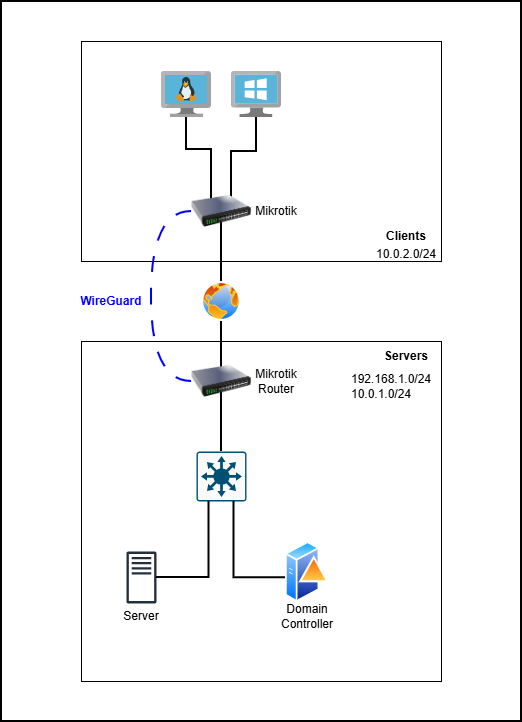

# MultiOffice WireGuard Zabbix Security v1

## Цель проекта

Построить сеть состоящую из двух офисов: офис с **серверами** и офис с **клиентами**.
Офисы должны быть логически **связаны** технологией **WireGuard**.

## Схема сети

## Узлы сети

- Mikrotik Router (Clients office)
- Mikrotik Router (Servers office)
- Linux/Windows Clients
- Mikrotik Switch
- Nginx Server
- Domain Controller: Windows Server 2025

## Используемые технологии

- WireGuard
- MikroTik RouterOS
- Linux (Debian)
- Active Directory
- Nginx

## Таблица IP-адресов

### Сегменты сети

| Сегмент    | Подсеть       | Назначение |
| ---------- | ------------- | ---------- |
| Server LAN (Router-Switch) | 192.168.1.0/24  | Сеть между маршрутизатором и коммутатором    |
| Server LAN | 10.0.1.0/24/24  | Серверы    |
| Client LAN | 10.0.2.0/24  | Клиенты    |
| WireGuard  | 10.1.1.0/24 | VPN        |

### Сетевые устройства

#### Mikrotik Router (Servers)
| Интерфейс | IP-адрес        | Назначение |
| --------- | --------------- | ---------- |
| eth0      | DHCP (Provider) | WAN        |
| eth1      | 192.168.1.1/24  | Switch LAN |
| wg0       | 10.1.1.1/24   | WireGuard  |

#### Mikrotik Switch (Servers)
| Интерфейс | IP-адрес        | Назначение |
| --------- | --------------- | ---------- |
| eth0      | 192.168.1.2/24 | Router LAN |
| eth1-eth2 | 10.0.1.1/24 | Server LAN |

#### Mikrotik Router (Clients)
| Интерфейс | IP-адрес        | Назначение |
| --------- | --------------- | ---------- |
| eth0      | DHCP (Provider) | WAN        |
| eth1      | 10.0.2.1/24  | Client LAN |
| wg0       | 10.1.1.2/24   | WireGuard  |

### Узлы сети

| Узел    | IP-адрес       | Интерфейс       |
| ---------- | ------------- | ------------- |
| Nginx Server | 10.0.1.2/24  | eth0  |
| Domain Controller | 10.0.1.3/24  | eth0  |
| Linux Client | DHCP (10.0.2.0/24)  | eth0  |
| Windows Client | DHCP (10.0.2.0/24)  | eth0  |
