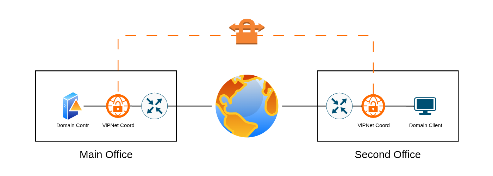

# Защищенный тунель между офисами с помощью координаторов ViPNet

Необходимо собрать сеть, в которой координаторы ViPNet создают защищённый тунель между двумя офисами. 
В качестве цели будет успешное подключение по внутреннему IP-адресу Windows-клиента к домену, сервер которого находиться в другом офисе

